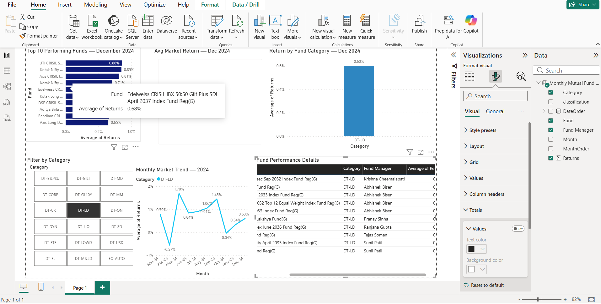

# 📈 Investment Performance Analytics — SQL + Power BI

> **Portfolio Analytics & Exception Monitoring Solution**  
> **Author:** Shivaling Bidaragaddi | Performance Measurement Analyst  
> **LinkedIn:** [linkedin.com/in/shivaling-bidaragaddi](https://linkedin.com/in/shivaling-bidaragaddi)

---

## 📌 Project Overview
This project delivers an end-to-end investment performance analytics workflow built using **SQL** and **Microsoft Power BI**. Inspired by institutional performance measurement protocols at **State Street**, the pipeline processes 2024 monthly mutual fund return data to track portfolio benchmarks, evaluate category risk, and flag return anomalies for operational audits.

---

## 🛠️ Tech Stack & Tools
* **Database & Query Engine:** SQL (SQLite / DB Browser for SQLite)
* **Data Visualization & BI:** Microsoft Power BI Desktop
* **Source Dataset:** Monthly Mutual Fund Returns 2024 (Kaggle)

---

## 💻 SQL Analytics Architecture
The core data transformation and audit logic are driven by advanced SQL scripts (`analysis.sql`), including:
* **Window Functions & Ranking:** Computing relative fund rankings across distinct investment categories.
* **Automated Exception Flagging:** Categorizing performance deviations (`HIGH EXCEPTION` $> 5\%$, `LOW EXCEPTION` $< 0\%$, and `NORMAL`).
* **Time-Series Aggregation:** Calculating month-over-month market trends and annualized performance benchmarks.
* **Outlier Isolation:** Extracting top/bottom performers and identifying funds with persistent negative returns.

---

## 📊 Interactive Power BI Dashboard



### Dashboard Features:
* **KPI Header Cards:** Real-time display of overall market average return.
* **Category Performance Slicer:** Dynamic filtering across 49+ mutual fund categories.
* **Trend Analysis:** Line chart visualizing month-by-month market movement.
* **Top 10 Fund Ranking & Detail Table:** Highlighting top alpha-generating funds and their associated risk exception flags.

---

## 🔍 Key Business Insights
* **Targeted Risk Audits:** Automated SQL rules isolated high-volatility return anomalies ($>5\%$), directly mirroring institutional exception investigation workflows used in global custody and performance operations.
* **Category Drivers:** Sectoral and technology-focused equity funds consistently generated outsized positive returns, while broad-market fixed income showed minimal variance.

---

## 📁 Repository Structure
```text
performance-analytics-sql/
├── analysis.sql
├── dashboard_screenshot.png
├── Monthly Mutual Fund Returns 2024.csv
├── Performance.db
├── performance-dashboard.pbix
├── screenshots/
│   ├── QUERY 1 View Sample Data.png
│   ├── QUERY 2 Total Funds in Dataset.png
│   ├── QUERY 3 Top 10 Funds by December 2024 Return.png
│   ├── QUERY 4 Bottom 10 Funds by December 2024 Return.png
│   ├── QUERY 5 Average Annual Return Per Fund.png
│   ├── QUERY 6 Best Performing Category.png
│   ├── QUERY 7 Performance Exception Flag.png
│   ├── QUERY 8 Funds with Negative Returns Dec-24.png
│   └── QUERY 9 Month-wise Average Market Performance.png
└── README.md
